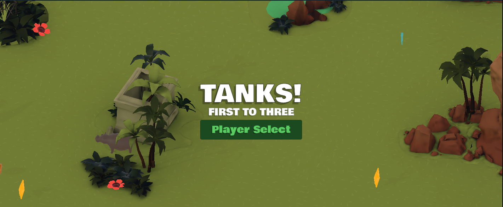

# TANKS! — First to Three

**TANKS!** is a local multiplayer arena battle game built in Unity. This project is based on the official [Unity Tanks Tutorial](https://learn.unity.com/course/tanks-make-a-battle-game-for-web-and-mobile) with my own additions on top, including a first-to-three win format, powerups, multiple tank types, and a player select screen.

🎮 **[Play the game here](https://play.unity.com/api/v1/games/game/94d9e7c0-b608-42aa-be14-75f5d990b8d1/build/latest/frame)**

---

## About the Game

Up to four players battle it out in a top-down arena. Each round ends when one tank is left standing. First player to win **3 rounds** wins the match. Powerups spawn around the map mid-round, rewarding players who stay active and control space.

---

## Players & Controls

| Player | Movement | Fire |
|--------|----------|------|
| Player 1 | WASD | Space |
| Player 2 | Arrow Keys | Enter |

Up to 4 players are supported via local multiplayer on the same keyboard.

---

## Tank Types

Choose from four tanks on the Player Select screen:

- **Crawler**
- **Heavy**
- **Shark**
- **UTV**

---

## Powerups

Powerups spawn at random locations and intervals during a round. Only one player can pick up each one.

| Powerup | Effect |
|---------|--------|
| Damage Reduction | Take less damage for a short time |
| Enhanced Shell | Fire a stronger shell on your next shot |
| Enhanced Shooting | Increased fire rate for a short time |
| Enhanced Speed | Move faster temporarily |
| Healing | Restore a portion of your health |
| Temporary Invincibility | Cannot take damage briefly |

---

## Round Format

- **2 to 4 players** — up to 2 local players, remaining slots filled by AI
- **First to 3 round wins** takes the match
- Rounds are short with a closing zone if no winner is decided in time

---

## Built With

- **Unity** — game engine
- **C#** — gameplay scripting
- **Unity Baked Lighting** — GI via MeshRenderer static flags

---

## My Additions

Built on top of the tutorial with these original changes:

- First-to-three win system with round tracking and a match end screen
- Powerup system with 6 pickup types and timed effects
- 4 selectable tank types with a Player Select screen
- Support for up to 4 local players

---

## Credits

Tutorial base by [Unity Technologies](https://learn.unity.com/course/tanks-make-a-battle-game-for-web-and-mobile). All additions built independently.
